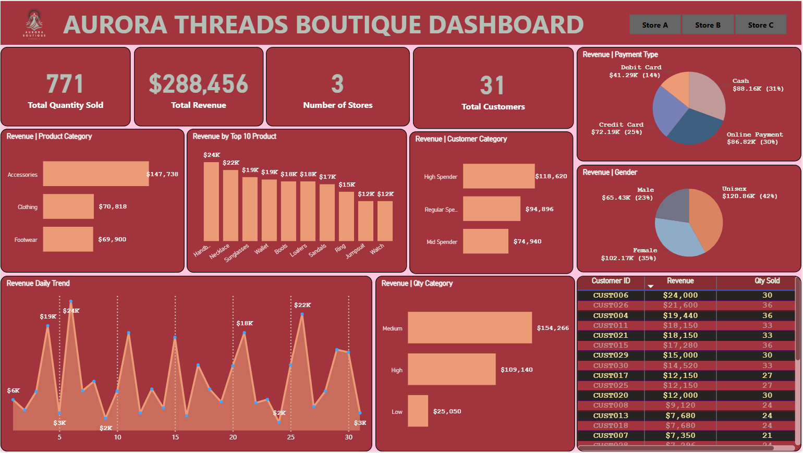
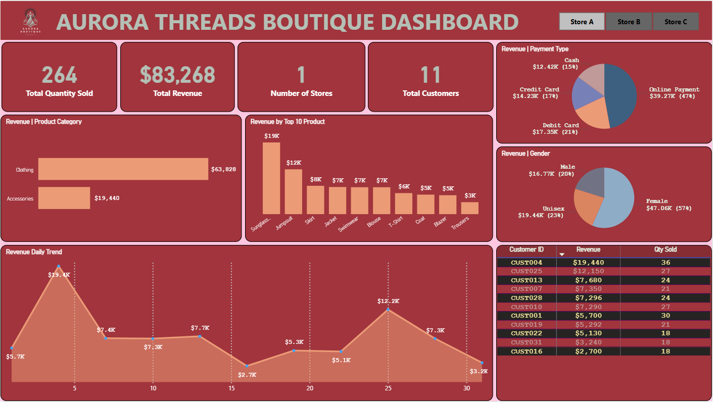
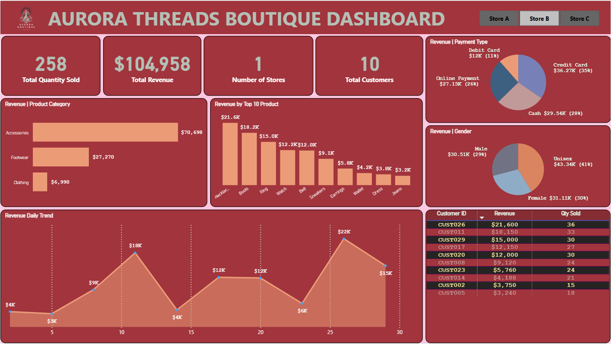
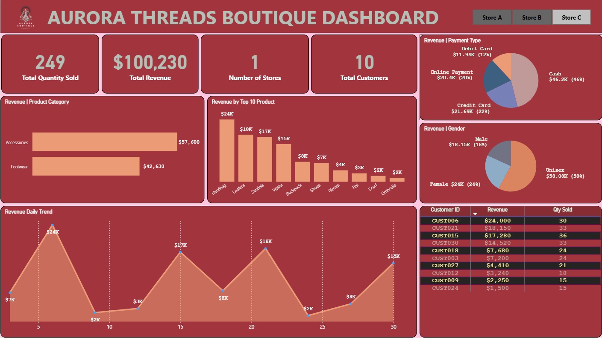

# Multi-store Retail Performance Analysis — Aurora Threads Boutique

  

---

## Business Overview
Aurora Threads is a premium fashion boutique specializing in high-end designer apparel, footwear, and accessories. Renowned for its curated collections and signature personalized shopping experience. The boutique operates three stores, catering to a discerning, fashion-forward clientele that values exclusivity and craftsmanship.

As competition intensifies in the luxury retail market, Aurora Threads is embracing data-driven decision-making to strengthen its strategic edge. With growing datasets capturing customer behavior, sales performance, product trends, and branch activity, the boutique now has the opportunity to uncover deeper insights in identifying top-performing categories, understanding high-value customer segments, and optimizing inventory allocation across locations. By leveraging these insights, Aurora Threads aims to refine its merchandising strategy, elevate customer engagement, and sustain its position as a leader in the luxury fashion space.

---

## Business Problem 
Aurora Threads is facing growing challenges in turning its expanding sales and customer data into meaningful insights. The boutique struggles to identify trends across product categories, track performance efficiently, and make timely, data-driven decisions. Without stronger analytical capabilities, key opportunities to optimize inventory, improve customer engagement, and boost sales performance are being missed.

**Key Problems**
1. Difficulty identifying category-level trends and shifting customer preferences
2. Inefficient performance tracking across branches and product lines
3. Limited visibility into product demand, leading to suboptimal inventory decisions
4. Lack of advanced analytics tools is slowing down decision-making
5. Missed opportunities to improve sales strategy and enhance customer experience

---

## Project Objectives

The objective of this project is to answer Aurora Threads’ most important business questions. 

These are:

1. Transform raw retail transaction data into a clear, intuitive, and insight-driven PowerBI dashboard

2. Analyze sales performance across products, customers, and store locations to answer key business questions

3. Identify patterns in customer behavior, product demand, and branch activity that impact revenue and growth

4. Enable interactive exploration through dynamic charts, filters, and slicers to support ad-hoc decision-making

5. Support data-driven decisions for inventory planning, product assortment, and merchandising strategy

6. Improve operational efficiency and business performance by replacing intuition-based decisions with actionable insights

7. Lay the foundation for a scalable, data-driven retail analytics model that supports sustainable growth and competitive advantage

---

## Data Dictionary
- **Date:** Date of the sale transaction
- **Store:** Store location
- **Product:** Product name or description
- **Category:** Product category (e.g., clothing, shoes, accessories)
- **Gender:** Gender of the target market for the product (e.g., male, female, unisex)
- **Quantity:**  Number of units sold
- **SalesAmount:** Sales amount for each product
- **CustomerID:** Unique identifier for each customer (for tracking repeat purchases and customer behavior)
- **Discount:** Discount applied to the transaction (if any)
- **PaymentType:** Payment method used for the transaction (e.g., cash, credit card, debit card,  online payment)

---

## Approach & Methodology
This project was developed entirely using **Microsoft Power BI**, covering the full analytics workflow — from data cleaning and transformation to modeling, analysis, and visualization. The objective was to analyze customer behavior, churn risk, and portfolio insights using an integrated and interactive Power BI dashboard solution.

**1. Data Cleaning & Transformation (Power BI Power Query)**
- Imported raw customer data into **Power BI** using Power Query Editor
- Performed data cleaning and transformation directly in Power BI:
  - Removed duplicates and filtered invalid or missing entries
  - Renamed columns and standardized field formats (e.g., text, numeric, dates)
  - Handled missing dates, prices, discounts, and units sold for transactions
  - Normalized CustomerID and transaction data.
  - Created **calculated columns** for:
    - `Customer Category` (Regular Spender, Mid Spender, High Spender)
    - `Quantity Category` (Low, Medium, High)
    - `Revenue`
  - Ensured consistency and data quality for downstream modeling

**2. DAX Measures (Power BI)**
- Created **custom DAX measures** to support key metrics and business logic, including:
  - `Total Quantity Sold`, `Total Customers`, `Total Revenue`, `Number of Stores`, etc
- Used **DAX functions** such as:
  - `CALCULATE`, `FILTER`, `DIVIDE`, `AVERAGEX`, `IF`, `VAR`, `COUNTROWS`, `DISTINCTCOUNT`, etc
- Applied calculated measures to support dynamic and filter-aware analysis across product categories and product lines

**3. Interactive Visualization & Dashboard Design (Power BI)**

Developed a comprehensive suite of interactive dashboards using **Power BI Desktop**

**Visualization Techniques:**
- Used card visuals, bar/column charts, donut charts, a table, and filters/slicers
- Enabled interactive drill-downs by store

**4. Insight Generation & Business Alignment**
- Identified key customer behavior patterns
- Translated findings into **actionable business recommendations**

---

🔗 [View the Live Dashboard](https://app.powerbi.com/view?r=eyJrIjoiYTU1NTcxY2EtMTJjMy00ZDAwLWJiMmMtNjRkMWY3ODAyZDNkIiwidCI6ImZmMGYzZTNhLTNlNTMtNDU0Zi1iMmI1LTZjNjg3NTNiOGVlNCJ9)

## 🔢 STORE-LEVEL DEEP-DIVE ANALYSIS
Each store was analyzed individually to evaluate strengths, weaknesses, and improvement opportunities.

### Store-A Performance Analysis & Insight

  

**1. Top KPIs (Key Performance Indicators)**
- Total Revenue: $83,268
- Total Quantity Sold: 264 Units
- Total Customers: 11

**2. Product Performance**
- Clothing leads sales with $63,828, followed by Accessories $19,440
- Top products include:
  - Sunglasses – $19K
  - Jumpsuit – $12K
  - Skirts – $8K
  
**3. Revenue Trends by Day**
- Peak days hit up to $19.4K (Day 4)
- Some days show performance dips below $3K, indicating fluctuating demand

**4. Customer Value**
- **CUST004** is the top customer, contributing $19,440 in revenue from 36 units, followed by **CUST025** with $12,150 from 27 units
- Revenue is highly concentrated, with a small number of customers accounting for a large share of total sales
- **CUST001** purchased a relatively high volume (30 units) but generated only $5,700 in revenue, indicating a lower average selling price and potential pricing or product-mix inefficiencies

**5. Payment Type**
- Online payments dominate with 47%
- Debit & credit card transactions make up the remaining majority (21% and 17% respectively)

**6. Gender Split**
- Female buyers represent 57% of total revenue, indicating stronger demand from women

**Insights**
- Product sales are dominated by Women’s wear, such as jumpsuits, skirts, jackets, swimwear, and blouses, indicating a strong preference for premium female fashion
- Store A experiences a higher share of digital payment methods, showing stronger adoption of modern checkout behavior
- Customer purchases suggest a higher female customer base, with consistent spending patterns

**Business Interpretation**
- Strong potential for expansion of women’s premium collections.
- Promotions on complementary products (jewelry, handbags) would likely improve basket size

### Store-B Performance Analysis & Insight

  

**1. Key Metrics**
- Total Revenue: $104,958
- Total Quantity Sold: 258
- Total Customers: 10

**2. Product Category** 
- Accessories lead with $70,698, followed by Footwear with $27,270
- Clothing is lowest, contributing $6,990

**3. Top Products are**
- Necklace – $21.6K
- Boots – $18.2K
- Ring – $15.0K
- Watch – $12.2K

**3. Sales Trend**
- Daily sales peak at $22K on Day 26 and are lowest on Day 5 with $3K. There is a fluctuation in the sales trend over the month, showing healthier revenue fluctuations compared to Store A

**4. Customer Value**
- Top customer “CUST026” contributed $21,600 with 36 units, representing a significant share

**5. Payment Type**
- Credit Card (35%) is the most used payment channel
- Cash (28%) comes second, then Online payment 26%

**6. Gender Split**
- Revenue is nearly balanced:
  - Unisex – 41%
  - Female – 30%
  - Male – 29%

**Insights**
- Store B generates stable but moderate performance across product lines
- Customers show a high affinity for accessories, indicating a strong focus on small fashion items and accessories
- Payment mix shows a higher share of credit card transactions, suggesting customers may be more price-conscious

**Business Interpretation**
- Campaigns such as “Buy More Save More” could help increase basket size
- Digital wallet or loyalty points could drive higher digital adoption

### Store-C Performance Analysis & Insight

  

**1. Key Metrics**
- Total Revenue: $100,230
- Total Quantity Sold: 249 Units
- Total Customers: 10

**2. Product Category**
- Accessories are highest at $57,600
- Footwear accounts for $42,630
- Clothing is not significant

**3. Top Products**
- Handbags – $24K
- Loafers – $18K
- Sandals – $17K
- Wristwatch – $15K

**4. Sales Trend**
- Best day reaches $24K, with lower days dropping to $2K, the widest gap among stores

**5. Customer Value**
- “CUST006” leads with $24,00 with 30 units, significantly above other buyers

**6. Payment Type**
- Cash dominates at 46%
- Credit Card – 22%
- Online payments – 20.4%
**Interpretation:** Customers in Store C are more traditional in payment preference

**7. Gender Split**
- The Majority of spending comes from Unisex products (58%)
- Female revenue is 24K (24%)
- Male contributions are lower

**Insights**
- Accessories and footwear contribute significantly to revenue
- Customer traffic is more varied by demographic, possibly due to better store location or broader assortment

**Business Interpretation**
- Increasing premium SKUs may yield strong returns
- Seasonal campaigns could further maximize store footfall

  
---

## Combined Overall Performance (All Stores)

  

**Key Consolidated Metrics** 
- Total Revenue: $288,456
- Total Quantity Sold: 771 units
- Total Customers: 31
- Number of Stores: 3

### **Revenue Overview**
**Top Product Category:**
- Accessories dominate with $147,738, accounting for over half of the total revenue

**High-Performing Products:**
- Handbags ($24K) and Necklaces ($22K) lead chain-wide

**Customer Contribution Patterns**
- Across all stores, revenue is concentrated among a few customers
- Top 1–5 customers account for over 33–40% of store sales

**This indicates:**
- High-value customers drive business.
- Customer loyalty or retention programs could be highly effective.

**Gender Revenue Breakdown**
- Unisex: $120.86K (42%)
- Female: $102.17K (35%)
- Male: $65.43K (23%)

---

## Cross-Store Comparison & Insights

**1. Revenue Comparison**
Store B leads in total revenue ($105K) despite selling fewer units (258) than Store A (264)
Store A moves the greatest volume, but at lower average price points

**Overall,** Store B is the top contributor to profitability, though all stores add meaningful value

**2. Payment Behavior Comparison**
- Store A: Strong online customer base (47%)
- Store B: Balanced mix across all payment channels
- Store C: Cash is the preferred method (46%)

**Overall Insight:**
- Payment preferences differ by location. Increasing online payment adoption in Store C could improve conversion, while Store A may benefit from targeted in-store promotions.

**3. Gender Purchasing Behavior**
- Store A: Female shoppers make up the majority at 57%, generating revenue of $47.06K
- Store B: Unisex products attract the largest share of buyers (41%), with revenue of $43.34K
- Store C: Unisex items also draw the strongest customer segment (58%) of $58.08K in revenue

**Overall:** Unisex products represent the greatest market opportunity across the chain, while the male gender contributed the least

**4. Product Strategy Differences**
- Store A: Clothing is the primary revenue driver, generating $63,828
- Stores B and C: Accessories lead in total revenue

**Chain-wide:** Accessories show the strongest growth and should remain a priority for stocking and marketing efforts

---

## Business Recommendations by Store

**1. Store A- Recommendations** 
- Increase stock and product variety in women’s premium clothing and accessories, as these are the strongest revenue drivers
- Introduce bundle sales (e.g., shoes + handbag + accessories) to increase average basket size
- Continue promoting cashless payment methods, as Store A customers already adopt more than other stores
- Launch VIP customer loyalty tiers, as Store A demonstrates a strong base of returning customers
- Use targeted digital campaigns to sustain customer engagement and high-margin sales

**2. Store B – Recommendations**
- Improve digital payment visibility and incentives (discounts for digital wallets, loyalty points)
- Use price-based promotions, as Store B’s market shows more price-sensitive customers
- Increase customer engagement through SMS and push promotional campaigns
- Introduce mid-priced product bundles to increase units per transaction
- Conduct customer surveys to understand barriers to digital adoption
- Launch VIP customer loyalty tiers, as Store A demonstrates a strong base of returning customers

**3. Store C- Recommendations**
- Increase inventory levels for high-velocity product lines (accessories, footwear)
- Offer seasonal promotions, as Store C responds well to traffic peaks
- Introduce up-sell support on the shop floor to push premium SKUs
- Expand product display areas, as walk-in traffic and product movement are already strong
- Analyze peak period staffing to maintain service levels

---

## Combined Store Strategic Recommendations

**1. Product Strategy**
- Expand unisex and women’s premium product lines group-wide
- Use store-specific assortment planning rather than standard allocation

**2. Pricing & Promotion**
- Implement centralized campaigns but localize execution per store to match customer psychology
- Invest in loyalty across all outlets (points, cashback, digital receipts)

**3. Payment & Technology**
- Push digital payment adoption using:
- Wallet discounts
- “Pay and earn” loyalty point schemes
- Faster checkout counters

**4. Store Format Improvements**
- Use Store A as a best-practice model for modern retail engagement
- Use Store C’s performance to benchmark inventory throughput and staffing optimization
- Use Store B as the experimental store for promotions and customer activation insights

---

## Executive Summary

Aurora Threads Boutique demonstrates solid commercial performance and clear market traction across its three store locations, each contributing distinct strategic value. 
- **Store A** leads in high unit sales and digital maturity, positioning it as the benchmark for customer monetisation.
- **Store B** maintains a well-balanced product assortment and the highest revenue,  showing the strongest upside for growth
- while **Store C** benefits from high footfall and rapid inventory turnover, delivering consistent and reliable cash flow.

Taken together, the portfolio reflects a stable and resilient business model with scalable customer demand. While each store presents targeted opportunities for optimisation, the combined performance indicates that Aurora Threads is well-positioned to accelerate growth through focused, data-driven investments rather than structural change.

--- 

## Disclaimer
This project is for portfolio and educational display only.

---

## Connect With Me
- 💼 **LinkedIn:** (https://www.linkedin.com/in/david-okeleye001/)
- 📧 **Email:** okeleyedavid2021@gmail.com
- 🌐 **Portfolio:** https://bit.ly/3N5c1p7
- 🐙 **GitHub:** https://github.com/olavidz01-dev
